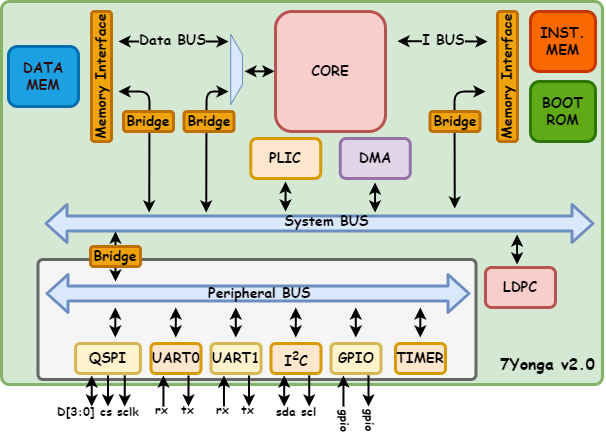

# 7Yonga Projesi

Başvuru Yaptığı Takım Adı:
Yeditepe Üniversitesi Sayısal Tasarım Topluluğu 

Takım ID:
#582202 

Başvuru ID:
#3062081 

Takımımız, Yeditepe Üniversitesi Elektrik-Elektronik ve Bilgisayar Mühendisliği lisans
öğrencilerinden oluşmaktadır. 7Yonga projesi kapsamında, açık kaynaklı bir RISC-V çekirdeği, çevre
birimleri ve veri yolları ile özgün bir mikrodenetleyici tasarlamayı hedeflemekteyiz. Bu
mikrodenetleyici, yüksek doğruluk ve düşük güç tüketimi öncelikleri doğrultusunda geliştirilecektir.

## Üyeler
* Muhammet Furkan UZUN
  - Öğrenim: Yeditepe Üniversitesi, Elektrik-Elektronik Mühendisliği 2. Sınıf öğrencisi.
  - İş yükü: Çekirdeğin, belleklerin, veri yollarının implementasyonu,
donanım hızlandırıcı
* Hasan GÜZELŞEMME
  - Öğrenim: Yeditepe Üniversitesi, Bilgisayar Mühendisliği 3. Sınıf öğrencisi.
  - İş yükü: Çekirdek implementasyonu, çevre birimleri tasarımı, devre
serimi
* Erhan ÖNALDI
  - Öğrenim: Yeditepe Üniversitesi, Bilgisayar Mühendisliği 4. Sınıf öğrencisi.
  - İş yükü: Çevre Birimleri tasarımı, testler, donanım hızlandırıcı

## Tasarım

## İş Planı

